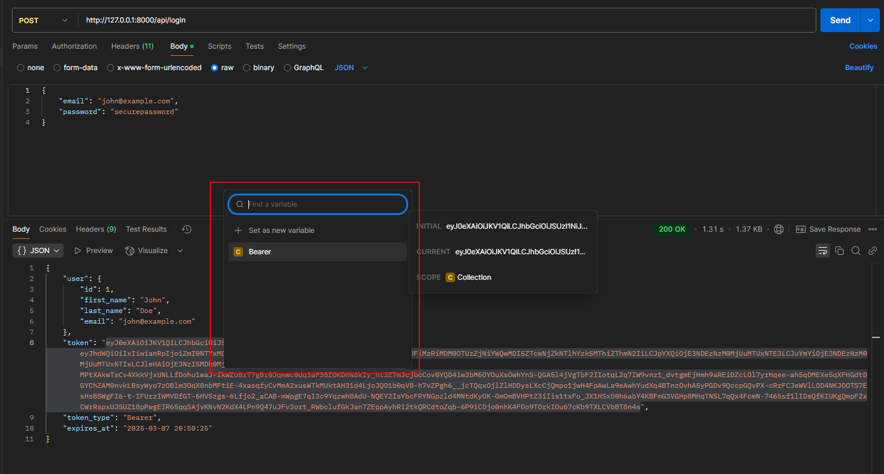

## **Tool Used**
- PHPStorm (IDE)
- Navicat (Database)

**Use Case**
- All Working screenshots are provided in the root/screenshot/
---
## **Setup Instructions**
### **Step 1: Clone the Repository**
```bash
https://github.com/abdulla-nilam/Practical-ASTUDIO.git .
git checkout master

```

### **Step 2: Install Dependencies**
```bash
composer install
```

### **Step 3: Set Up Environment**
1. Copy `.env.example` to `.env`
```bash
cp .env.example .env
```
2. Generate the application key (If not)
```bash
php artisan key:generate
```
3. Configure your database credentials in `.env`:
```ini
DB_CONNECTION=mysql
DB_HOST=127.0.0.1
DB_PORT=3306
DB_DATABASE=laravel
DB_USERNAME=root
DB_PASSWORD=
```

### **Step 4: Run Migrations and Seeders**

```bash
php artisan migrate:fresh --seed
```

### **Step 5: Set Up Laravel Passport**
```bash
php artisan passport:install
php artisan passport:client --personal # if needed
```

### **Step 6: Serve the Application**
```bash
php artisan serve
```


---

## **API Documentation**

**!!! We can use SWAGGER for the API. Since its paid just giving some endpoint here**

Authentication
 - POST /api/register
 - POST /api/login
 - POST /api/logout
Projects
 - GET /api/projects → Get all projects
 - POST /api/projects → Create a project
 - GET /api/projects/{id} → Get project details
 - PUT /api/projects/{id} → Update a project
 - DELETE /api/projects/{id} → Delete a project
Timesheets
 - GET /api/timesheets → Get all timesheets
 - POST /api/timesheets → Create a timesheet entry
 - GET /api/timesheets/{id} → Get timesheet details
 - PUT /api/timesheets/{id} → Update a timesheet entry
 - DELETE /api/timesheets/{id} → Delete a timesheet entry
Attributes & Attribute Values
 - GET /api/attributes → Get all attributes
 - POST /api/attributes → Create an attribute
 - GET /api/attributes/{id} → Get attribute details
 - PUT /api/attributes/{id} → Update an attribute
 - DELETE /api/attributes/{id} → Delete an attribute
 - GET /api/attribute-values → Get all attribute values
 - POST /api/attribute-values → Create an attribute value
 - DELETE /api/attribute-values/{id} → Delete an attribute value

---

## **Example API Requests**
### **You can use given postman payload in the root** [AStudio.postman_collection.json](AStudio.postman_collection.json)
Use this to set the bearer
(sample)
### **Register User**
```bash
curl -X POST "http://127.0.0.1:8000/api/register"
  -H "Content-Type: application/json"     
  -d '{
         "first_name": "John",
         "last_name": "Doe",
         "email": "john@example.com",
         "password": "password"
     }'
```
🔹 **Response**
```json
{
    "user": {
        "id": 1,
        "first_name": "John",
        "last_name": "Doe",
        "email": "john@example.com"
    },
    "token": "your_access_token_here",
    "token_type": "Bearer",
    "expires_at": "2024-03-06 14:00:00"
}
```

---

### **Login User**
```bash
curl -X POST "http://127.0.0.1:8000/api/login" 
  -H "Content-Type: application/json"
  -d '{
         "email": "john@example.com",
         "password": "password"
     }'
```
🔹 **Response**
```json
{
    "user": {
        "id": 1,
        "first_name": "John",
        "last_name": "Doe",
        "email": "john@example.com"
    },
    "token": "your_access_token_here"
}
```

---

## **Rate Limits**
| Endpoint           | Limit (Requests per Minute) |
|-------------------|--------------------------|
| `/api/register`   | 5 |
| `/api/login`      | 5 |
| Authenticated APIs | 60 |


